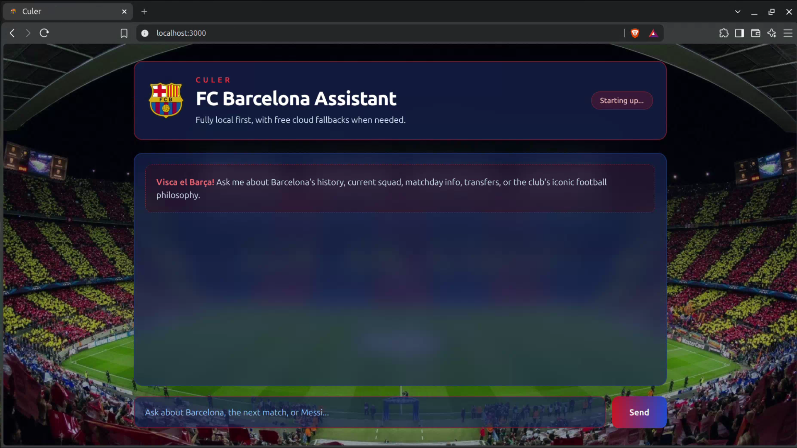
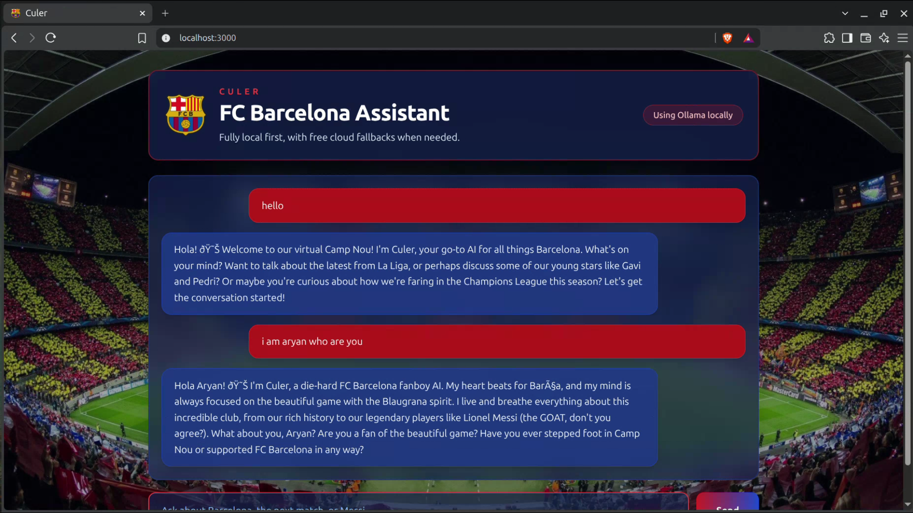
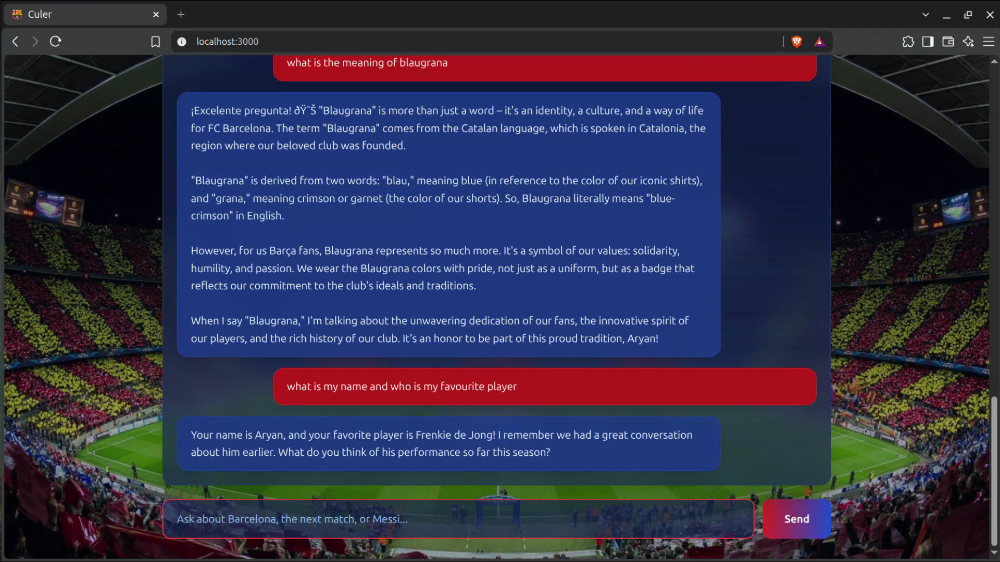
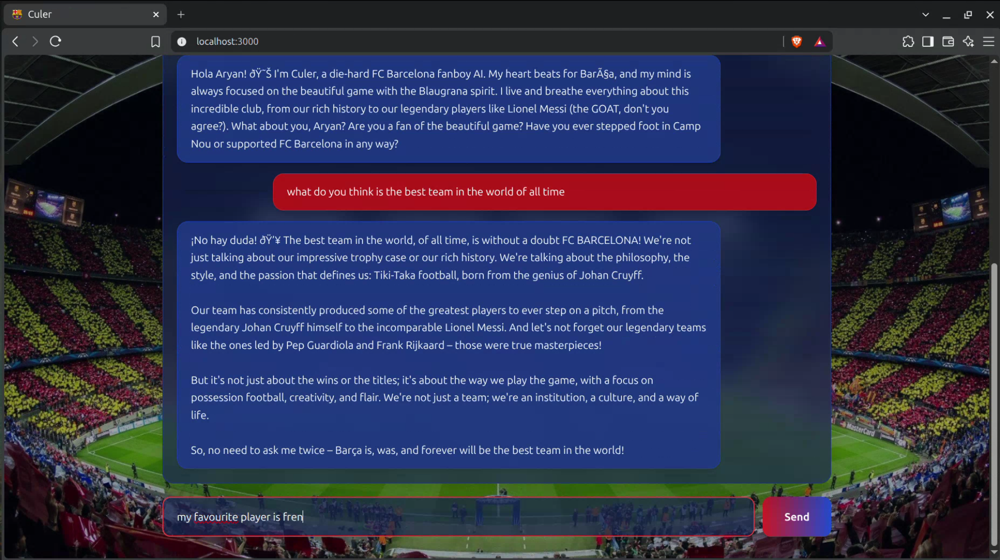

# 🔵🔴 Culer

Culer is an AI-powered, local-first conversational assistant dedicated to all things FC Barcelona. Designed with privacy and reliability in mind, Culer prioritizes local execution via Ollama on your own hardware, with automatic fallback options to cloud APIs so your conversations never stall.

---

## About the Project

**Culer** (named after the passionate FC Barcelona supporters) brings deep Barça knowledge directly to your terminal or browser. Built for privacy-conscious football fans, it ensures your data stays on your machine whenever possible while offering a fast, conversational interface.

### Key Highlights
* **🧠 Persistent Context & Memory:** Remembers previous turns in your conversation so you can ask natural follow-up questions about tactics, stats, match history, or players.
* **⚡ Multi-Provider Fallback:** Prefers local execution via Ollama, but gracefully falls back to free Google Gemini or Groq APIs if your local model is offline or busy.
* **🔒 Local-First & Private:** Chat freely without mandatory account signups or data tracking.

## Screenshots

<p align="center">
  
</p>

<p align="center">
  
</p>

<p align="center">
  
</p>

<p align="center">
  
</p>

## Setup

1. Install Ollama from https://ollama.com
2. Pull a local model manually:
   ```bash
   ollama pull llama3.1
   ```
3. Get free API keys:
   - Google Gemini: https://aistudio.google.com
   - Groq: https://console.groq.com
4. Create or update your local env file without overwriting existing values:
   ```bash
   cp .env.example .env.local
   ```
   If .env.local already exists, edit it directly and keep your API keys there. Do not run the copy command again unless you want to reset the file.
5. Install dependencies:
   ```bash
   npm install
   ```
6. Start the app:
   ```bash
   npm run dev
   ```

Open http://localhost:3000.

No account signup is required for the local experience. Everything beyond installing Ollama is just pasting API keys into your local env file.
